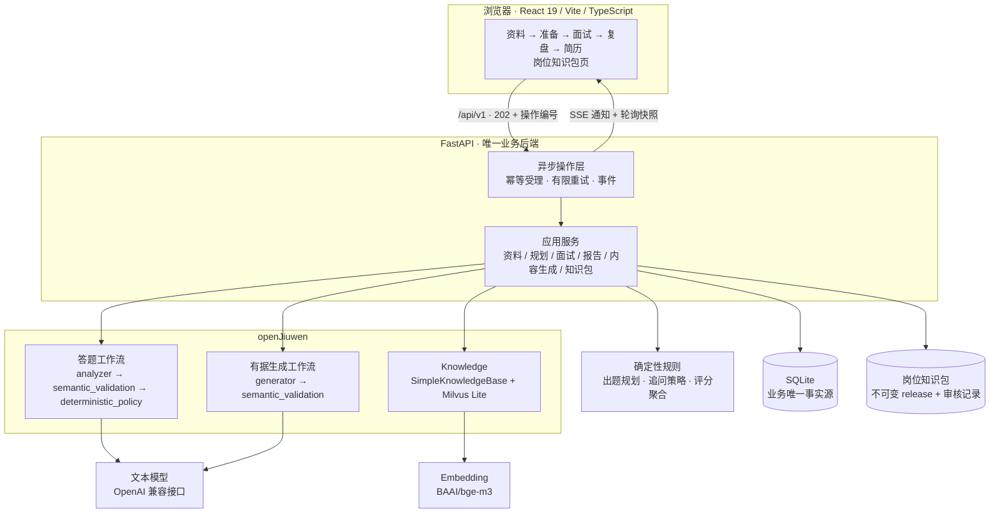
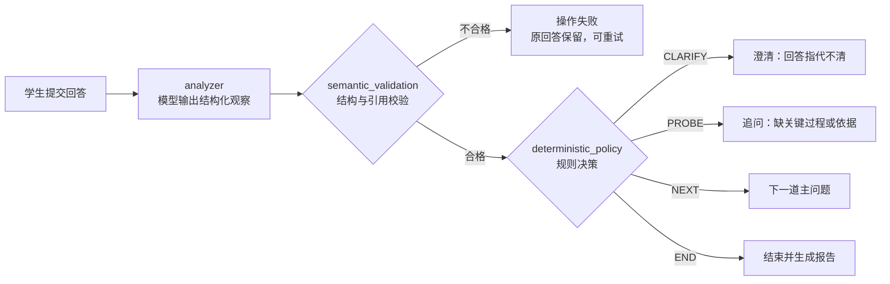
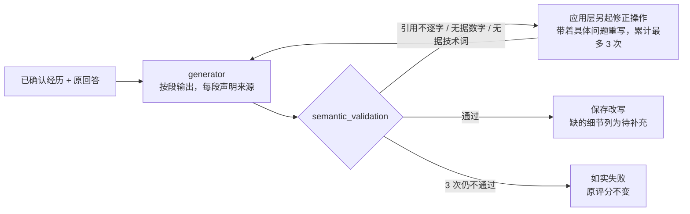
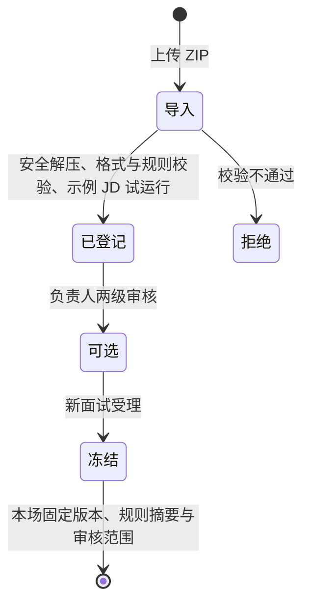

# 职觉 ZhiJue · 可信 AI 面试陪练智能体

面向实习 / 初级岗位的 AI 面试陪练。学生上传简历并逐条确认经历，贴入目标岗位要求；系统从审核过的岗位知识包中出五道题，由规则决定追问、换题和计分，每一步写明原因；复盘时把回答**逐段**改写，每段都标出来自学生原话还是已确认的经历，缺的细节留给学生自己补，不替学生编造。

基于华为开源的 [openJiuwen](https://github.com/openJiuwen-ai/agent-core) 框架开发：两条 openJiuwen Workflow + openJiuwen Knowledge + 确定性规则引擎，React 前端，单一 FastAPI / SQLite 业务后端。

- 在线演示：<https://study.hongyue.eu.cc>（live 模式，连接真实模型；演示数据为合成材料，请勿上传真实简历）
- 演示岗位：嵌入式软件 · 初级（已审核）；Python 后端 · 初级（待审核，暂不开放）

## 核心功能

| 功能 | 做法 |
|---|---|
| 简历理解 | 上传 PDF 或手填，拆成逐条经历并按段落分组；每条可对照原文，学生采用、更正或不采用后才生效 |
| 五道主问题 | 对照岗位要求与已确认经历，排出五个提问方向；题目来自审核过的岗位知识包 |
| 有界追问 | 模型分析回答，规则决定澄清、追问、换题或结束；每题最多补问一次，并显示原因 |
| 可追溯评分 | 按冻结的评价量表逐项定级，分数由程序计算，每项附回答原文引用；没测到的不算零分 |
| 逐段证据绑定的回答优化 | 每段声明来源（原话或已确认经历），引用逐字校验；不通过就带着问题重写，最多 3 次 |
| 简历生成 | 每一行关联一条已确认经历，学生确认后可打印为 PDF |
| 岗位知识包 | 能力规则、题目、评分要点与来源打成 ZIP，导入、负责人两级审核后可选；每场面试冻结版本 |

## 系统架构



- **模型只做两件事**：分析回答、生成候选文本。追问与否、分数多少、内容能否入库，都由程序决定。
- **单一写入方**：只有 Python 后端写业务库，每次更新带版本号；知识索引可由业务库重建。
- **异步操作**：上传、确认、回答、生成都以“操作”受理，客户端用操作编号查询；同一请求重复提交找回原操作，失败如实落库并可显式重试。

### 一次回答的处理



每道主问题最多一次补问；决策理由（`reason_summary`）显示在页面上，不展示模型隐藏思考。

### 逐段证据绑定



同一套来源校验用于三项任务：简历经历抽取（P-EXTRACT）、回答优化、简历生成。其中回答优化和简历生成不通过时带着问题重写；经历抽取不通过则整批不落库，如实失败。团队对照实验（5 个模型、32,400 个任务）中，直接让模型润色时 29.6% 的回答出现事实问题，逐段绑定来源降到 8.8%。

### 岗位知识包



规则是声明式数据，不含可执行代码；内容改动一个字节都需要重新审核；撤销审核只影响新场次，历史面试与报告始终可复查。

## 快速开始

需要 Python 3.11、[uv](https://docs.astral.sh/uv/)、Node 24、pnpm 10。

```bash
make setup          # 按锁文件安装前后端依赖，不发送模型请求
make check          # Ruff、后端离线回归、接口规范、完整性、doctor
pnpm --dir apps/web test
make demo-fixture   # 合成环境演示，不调用模型
```

live 模式需要两份私密配置（文本模型与 embedding，模板见 `config/environment.env.example`），启动与部署见 [运行手册](docs/11-runbook.md)：

```bash
make demo-live      # 读取私密 env 启动；不会自动发送测试请求
```

- Node 25 及以上运行前端测试时需设置 `NODE_OPTIONS=--no-webstorage`。
- openJiuwen 锁定在 `hongyue0721/agent-core@72c4985`：官方 v0.1.18 加上官方 PR #1344（MilvusLite 删除返回值兼容），正式 0.1.18 wheel 尚未包含该修复。

## 目录

```text
apps/web/                 React 前端（六个页面）
services/api/src/zhijue/
  api/                    FastAPI 路由、DTO、应用装配
  application/            应用服务与两条 openJiuwen 工作流
  domain/                 纯函数领域规则：规划、追问策略、评分、来源校验
  adapters/               SQLite 仓储、Knowledge 网关、模型适配
services/api/migrations/  Alembic 数据库迁移
knowledge_packs/          嵌入式 / Python 后端岗位知识包源文件
contracts/                OpenAPI 与 JSON Schema
docs/                     需求、架构、数据模型、工作流、测试与运行手册
```

## 测试与验证

- 后端离线回归 615 项、前端 107 项通过；接口文档、OpenAPI 与 JSON Schema 三方一致（`make check`）。
- 真实模型全流程在 deepseek-flash、qwen3.8-flash 等模型上运行过：上传 → 抽取 → 确认 → Knowledge 激活 → 五题作答 → 报告 → 回答优化 → 简历。
- 在 openEuler 24.03 LTS-SP2 官方镜像中完成锁定安装与启动验证。

## 文档

| 文档 | 内容 |
|---|---|
| [产品需求](docs/01-prd.md) | 用户旅程、19 条编号需求与验收标准 |
| [架构](docs/02-architecture.md) | 技术栈、模块边界、部署拓扑 |
| [数据模型](docs/03-data-model.md) | 资料、证据、状态与版本 |
| [工作流与策略](docs/04-workflow-policy.md) | 状态转换、追问策略与停止规则 |
| [Knowledge 与题库](docs/05-knowledge-and-bank.md) | 知识库集成、题目来源治理 |
| [提示词与事实约束](docs/06-prompts-and-factuality.md) | 结构化输出、来源校验、评分与改写 |
| [测试与验收](docs/07-test-and-acceptance.md) | 测试矩阵与发布门槛 |
| [界面规范](docs/08-ux.md) | 页面、交互、响应式与可访问性 |
| [运行手册](docs/11-runbook.md) | 配置、部署、故障恢复、备份与删除 |
| [API](api.md) | HTTP 接口、错误码、异步操作与 SSE |
| [开发过程记录](process.md) | 每轮改动、验证证据与未解决问题 |

## 边界

- 定位是练习陪练：不做录用判断，不认证简历真伪，不替学生补写经历。
- 用户确认的经历只代表“本人确认”，评分只针对本场回答。
- 规则格式通过不等于岗位专业性；新岗位须经负责人两级审核后才可用于面试。
