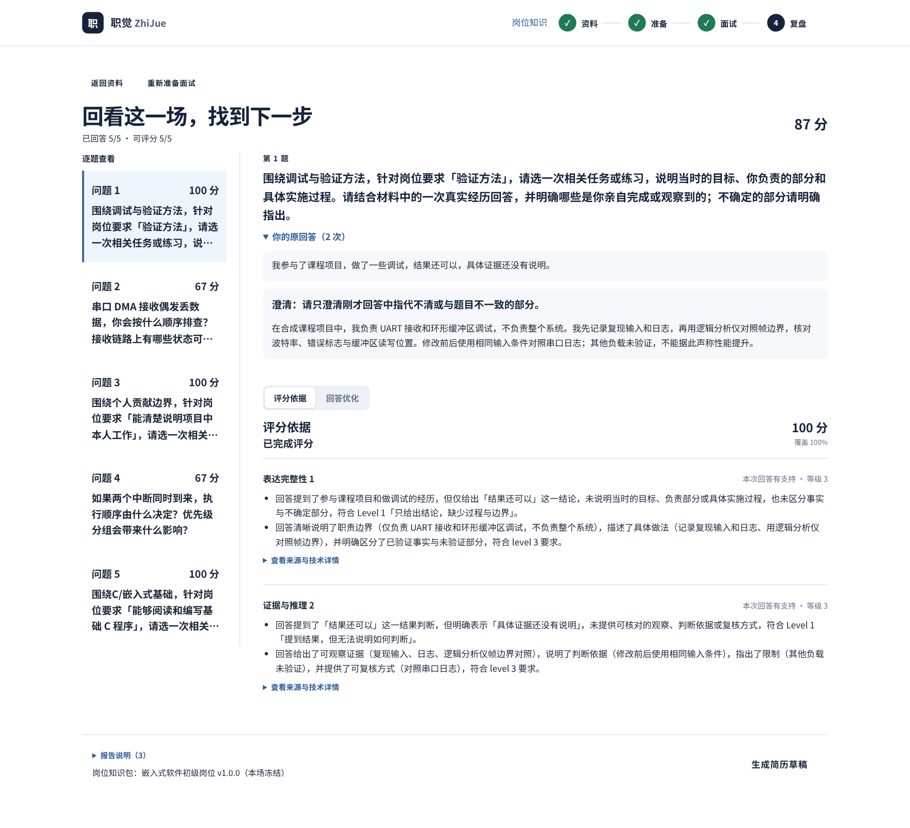
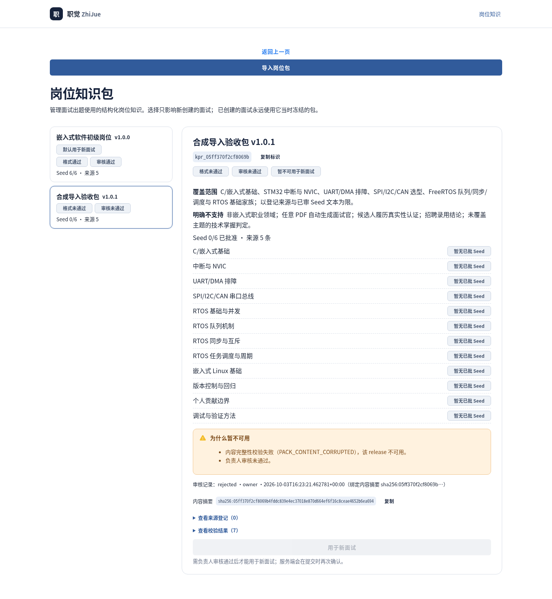

# 职觉 ZhiJue｜嵌入式软件岗位面试陪练

以经用户确认的材料为起点，通过 openJiuwen Knowledge 与 Workflow 完成五题面试、有限追问、可追溯评分和不编造经历的回答优化。React/Vite/AnyUI 前端，单一 FastAPI/SQLite 业务数据库；结构化岗位 Seed 不强制向量化。

**当前状态（2026-10-03）：功能已实现；本地离线与实际浏览器已验证；live 存在成功链和明确失败样本，尚未完成最终版本全新上传闭环及负责人独立验收。没有公网发布。**

## 首次运行

准备 Python 3.11、uv、Node 24 和 pnpm；精确依赖及来源见 `config/versions.lock.json`、`services/api/uv.lock`、`apps/web/pnpm-lock.yaml`。在仓库根目录执行：

```bash
make setup                          # 锁定安装，不发送模型请求
make check                          # 后端离线回归、规范、完整性、doctor
pnpm --dir apps/web test
pnpm --dir apps/web build
make demo-fixture                    # 仅合成状态演示，默认 loopback
```

fixture 的 Knowledge/分析结果是合成实现，不能证明模型质量；默认没有内容生成器，“回答优化/生成简历”会如实提示依赖未配置。live 需要独立私密配置和外部服务，启动、预算与材料外发边界见 [运行手册](docs/11-runbook.md)。有 API key 不等于授权使用真实材料或额外模型预算。

最小流程：资料导入或手填 → 逐条确认事实 → 等待当前快照知识激活 → 填写岗位要求并选择可用知识包 → 生成五题计划 → 回答及受控追问 → 报告 → 配置生成能力后优化回答/生成简历 → 人工确认后打印。用户确认不等于履历认证；评分不是招聘录用结论。

## 岗位知识与数据边界

- 当前只支持嵌入式初级领域，一个能力配置与六条历史已审 Seed；不宣称任意职业换包即用。
- 岗位包 ZIP 是结构化出题资料，不是候选人文档索引。格式通过、负责人审核、可用于新面试是三个独立状态；上传自带 `approved` 不构成授权。
- 选择只影响新建面试。受理时冻结 release、实际内容摘要与当时批准范围；导入新版不全局切换默认包，历史场次不追随当前审核。
- 未经明确授权，不迁移真实业务库、不批准新知识、不发送真实材料、不公开部署。

## 当前验证与演示证据

- 后端离线：**476 passed / 2 deselected**；Ruff check/format 全范围通过（96 文件）。
- 前端：**44 passed**；TypeScript/Vite 构建通过（122 modules）。
- 实际 Chromium：六页 × 四个尺寸，以及导入恢复、JD 往返、慢响应、空态/连接失败、拒绝/损坏状态、键盘焦点与浅色方案，见 [本轮验收及边界](docs/aic/2026-10-03-acceptance.md)。
- 正常 live launcher 使用 qwen3.8-flash 与已确认、真实 BGE-M3 索引资料：五根题、两次追问、87 分完整报告、五条优化建议已取得真实结果；简历复用同快照同目标的既有 accepted 草稿。**这不覆盖全新上传：两次独立上传分别失败于事实来源校验和上游请求。**





源码发行及独立解压验证：

```bash
make competition-bundle
make verify-bundle
```

最终发行物指纹及独立安装/回归/fixture 验收结果记录在包外 `dist/bundles/*.verification.json`；源码文档不预先为尚未验证的 ZIP 签发通过结论。迁移与回滚步骤见本轮验收记录。


## 历史工程快照（2026-09-25；以下记录按原日期与原验证范围理解）

- `M0-02`：真实 openJiuwen Workflow/WorkflowAgent smoke 已实现并完成本地回归，状态 `IMPLEMENTED`；额外官方 Base Agent/starter 要求仍 `BLOCKED / UNCONFIRMED`。
- `M0-03 / M0-03-DEL`：真实 Knowledge 四进程生命周期 `VERIFIED`，覆盖解析、入库、检索、provenance、重启、删除和删除后重启零命中。项目临时锁定到基于 openJiuwen v0.1.18 和官方 PR #1344 的兼容 commit `72c4985111b835530ec616f70dd67117eb2e015c`；不得描述成官方新发布版。
- `M0-04`：版本锁、只读 doctor、干净重装、Node 24/pnpm 前端锁与 CI 骨架已本地验证；CI 尚未推送运行。
- `M1-01`：14 表 SQLAlchemy/Alembic 持久层、唯一约束/FK、Operation 幂等和事件状态机 `VERIFIED`。
- `M1-02 / M1-03`：真实 PDF 导入、SourceBlock、Claim 状态机、更正留痕、不可变确认快照、Knowledge 激活、FastAPI 资料/Operation/SSE 路径及浏览器确认界面均 `VERIFIED`。
- `M2-01`：六条 Seed 的 S24/S26/S28/S29/S30 官方来源、claim 和平台边界已逐条核对，负责人明确全部通过并批准；当前版本 `0.2.1`、Level 2 `passed`、`review_status=approved`，审核记录为 `review_m2_01_level2_owner_20260919`。批准只覆盖这六条，不授权扩到 24 条。
- `M2-02`：真实 Demo Resume v1 PDF→21 facts→Knowledge→显式 `SYNTHETIC_DEMO_JD`→8 Requirements→Coverage Map→5 Slots live 通过。不可验证的真实 JD 宣称已撤回，伪造/缺失 provenance 会 `JD_PROVENANCE_INVALID`。
- `M2-03`：计划工作台曾在 Seed 批准前用真实浏览器跑通资料快照、synthetic 警示、unknown 边界、5 Slots、首题门禁和刷新恢复；该历史验收当时没有生成题目或调用业务 LLM。
- `M3-01`：approved Seed 首题实例化、真实 openJiuwen handle-answer Workflow、真实 `deepseek-flash` Answer Analyzer、Observation 语义校验和确定性 Policy 已闭环。首轮 live 暴露 Prompt 未明确 `finding` 枚举；收紧输出契约并把 SDK 组件异常改为不携带模型文本的固定错误后，第二轮 1 次 HTTP 调用通过，状态 `VERIFIED`。
- `M3-02`：Answer/Operation 原子受理、并发单写入、幂等重放、durable event、失败保留、累计三次 retry 与重启 interrupted 恢复已按本地后端范围 `VERIFIED`。
- `M3-03`：`/start`、`/profiles/:id/prepare`、`/interviews/:id` 三页业务链 `VERIFIED`；负责人后续明确授权后已与 Report/Resume 一并完成五页首屏、响应式、中文展示语义和 lost-202 恢复。真实 fixture 纵切面继续覆盖 PDF/blocks、手工 fact/确认快照、演示与用户 JD、五题计划、PROBE/CLARIFY/NEXT/END、失败重试、幂等与 polling 收敛。跨代理 UTF-8 分块与 `EVENT_HISTORY_GONE` 组合仍未做浏览器级验收。
- `M4-01`：新增确定性根题评分、`POST /interviews/{id}/control`、`GET /interviews/{id}/report`、Assessment/Report 唯一约束和 `report.ready`。未测/跳过/覆盖不足/冲突均保持 null；至少三根 scored 才给总分。自然五题、主答+追问合并、skip/end、回答中 end、报告失败后无模型重调 retry 均通过；状态 `VERIFIED`。
- `M4-02`：`report.coach` 与 `resume.compose` 通过真实 openJiuwen Workflow 编排和确定性来源校验；Report/Resume API、持久化、事件、retry、五页 Product Polish 与打印均完成。生产 `deepseek-flash` 首轮暴露 Prompt 没有实际下发 Schema 结构，服务端正确拒绝；明确精确字段后，synthetic coaching/resume 均通过原 Schema 和事实校验。负责人独立验收仍 `NOT_RUN`，状态保持 `IMPLEMENTED`。
- `M4-02-DESKTOP`：快照代次激活门禁/恢复、无简历与独立简历入口、批量事实核对、岗位修改、skip/end、报告原题/原答和桌面浅色布局已实现。负责人 live 上传暴露的 P-EXTRACT 模型 HTTP 超时已与模型返回后的来源校验失败分型；按负责人要求，所有业务模型请求现显式发送 `reasoning_effort=low`。最新后端回归为 299 passed / 2 deselected / 78 warnings，Ruff 78 files。前端仍为 9/9、TypeScript 和 Vite 112 modules 通过；三个桌面尺寸/light-dark 实际浏览器证据与静态完整性结果见 process §43，本次 live 超时与低思考配置见 §44—§45。负责人须重新上传原文件才能验证上游恢复，不宣称本轮移动端或生产模型质量通过。
- 模型实测：BGE-M3 embedding 已 live；`deepseek-flash` Answer Analyzer 成功样本为 10.650749 秒、usage 1156/2544/3700；Content Generator 成功 coaching/resume 分别为 27.727351/10.839200 秒、usage 669/6377/7046 与 535/2325/2860。provider 未返回价格，cost 均为 null / NOT_MEASURED；不估造费用。
- `AIC-PACKS`：结构化岗位知识包契约（manifest/competencies 声明镜像/sources/内容摘要）、不可变 release 与包外负责人审核（CLI 登记，逐条绑定 Seed 内容 hash）、ZIP 安全解压上限、`GET/POST /knowledge-packs*` 异步导入（202+Operation+回执持久）、面试受理时冻结 `pack_release_id+content_digest+competency_profile_id`、`/knowledge-packs` 知识页与准备页选择器已实现；ADR-014 记录决策边界。离线回归 395 passed / 0 failed，前端 29/29 + build，真实浏览器 fixture 纵切面（导入→unreviewed→负责人批准→冻结出题）通过。2026-09-27 负责人授权后 live 模型端到端已 VERIFIED（见 process.md §63：真实 P-EXTRACT/分析/评分/优化/草稿全链通过，浏览器实拍 live 报告页；embedding 腿为本地隔离 shim，非 BGE-M3 等价声明）。负责人对审核 CLI 结论与本批网关兼容变更的独立复核仍 NOT_RUN。

当前事实与待验收项以 [process.md §64](process.md#64-2026-10-03竞赛工作区集成与验收收口implemented本地范围-verified) 和 [本轮验收记录](docs/aic/2026-10-03-acceptance.md) 为准；历史模型和系统记录不能替代本轮。已有数据库部署前需显式选择、停写备份，再执行 `a7c4e1f29b58` 和 `c91f8b34d602` 迁移；后者新增的旧行审核快照保持 null，不倒填今天的审核。本轮迁移 smoke 仅使用自建 synthetic 库的副本，未迁移负责人真实业务库。

## 项目一句话

面向本科生的嵌入式软件岗位面试陪练：以经用户确认的材料为起点，使用真实 openJiuwen Knowledge 与 Workflow 完成出题、回答分析、有限追问、可追溯评分及不编造经历的回答优化。

## 冻结的 Demo 边界

- 两个入口：**整理简历**、**直接面试**；共用一份版本化资料，不强制先生成简历。
- 一个主演示岗位：嵌入式软件实习/校招初级岗位。五道主问题，每题最多一次补充追问或澄清。
- 初期六条题目种子打通流程；发布目标二十四条经审核种子。数量不是发布成绩。六条种子现以 `embedded-software-junior` 内置岗位知识包登记（M2-01 负责人批准范围逐条内容 hash 迁移映射，见 ADR-014）。
- 核心：材料确认 → Knowledge 入库检索 → 五题计划 → 作答 → 分析与规则决策 → 评分 → 优化回答。
- PDF/文本上传先落不可变 SourceBlock，再由真实 P-EXTRACT Workflow 选择可逐字回查的待确认事实；上传不会自动确认候选事实。
- OCR、跨场次训练记忆属于 P1。P0 必须识别扫描 PDF 并提供粘贴文本的降级路径，不能把降级说成 OCR 已实现。
- 不做招聘录用判断、岗位爬虫、联网全知问答、语音、多人 Agent 协商、复杂概率能力模型、完整简历编辑平台。岗位知识包只支持已注册能力配置（当前一个领域包）；不宣称任意职业换包即用，也不做影响历史面试的全局切换。

## 和前期讨论的明确调整

| 前期想法 | 本版决定 | 原因 |
|---|---|---|
| 保留整个旧 Next.js 平台 | 默认新建精简 React/Vite 前端，旧组件按需移植 | 用户允许放弃旧平台；Demo 不需要 SSR 和第二个业务后端 |
| Next.js/Drizzle 与 Python 都接 SQLite | 仅 Python 持有业务数据库写权限 | 避免双 Schema、双迁移、双状态源 |
| 一百至一百五十条题库 | 六条起步，二十四条发布目标 | 时间优先用于答案边界、来源审核和失败测试 |
| 用 0.87 等能力置信度 | 离散的本轮表现状态与证据充分度 | 未经校准的数字不是概率 |
| SQLite 检索就算 openJiuwen Knowledge | 必须实接框架知识库；SQLite 只做业务事实账本 | 不用同名自建类冒充指定框架模块 |
| 改写答案之后分数上涨就是进步 | 改写只展示建议；另题复测才讨论迁移表现 | 避免“模型给自己生成的答案打高分” |
| 网络断开仍能完整运行 | 本地资料可读；远程 LLM 中断时暂停或明确回放 | 本地数据库不等于模型离线运行 |

本版是建议采用的施工基线。负责人不需要逐项重新批准普通实现细节；涉及额外费用、公开部署、数据外发、框架替换、实质扩范围时必须确认。

## 阅读顺序

喜欢连续阅读时可打开 [离线阅读版](阅读版.html)，该 HTML 保留 1.0.0 初始规范快照。[静态检查记录](validation-report.md) 是随源码冻结的发布记录；`make spec` 的新记录写入 `runtime/validation-report.md`，不改发行源码校验和。当前施工事实以 `process.md`、`CHANGELOG.md` 和最新 handoff 为准。

**负责人先读：** [给鸿岳的实施规划与准备清单](docs/00-owner-guide.md) → [产品需求](docs/01-prd.md) → [里程碑与演示](docs/12-plan-and-demo.md)。

**施工 AI 先读：** [AGENTS.md](AGENTS.md) → [process.md](process.md) → [产品需求](docs/01-prd.md) → [架构](docs/02-architecture.md) → [api.md](api.md) → 当前任务关联文档。

**首次启动任务：** 将 [首次施工指令](ai-prompts/01-start.md) 交给 AI。首次只完成 M0 技术验证与环境锁定，不允许一次铺开全部功能。

## 唯一演示资料

负责人指定的唯一演示资料集另存于私有仓库：[zhijue-face-demo-data](https://github.com/hongyue0721/zhijue-face-demo-data)：千早爱音原始简历 PDF、对应 Demo JD v1 和完整嵌入式初级岗位知识包。仅获授权的 GitHub 账号可访问；该仓库 README 登记文件来源、用途、复现步骤及验证边界。

PDF 仅作为负责人指定的演示输入，不据此判断人物与经历真实或虚构；Demo JD v1 仍标记为合成岗位配置，不是已核验企业招聘公告。岗位知识包不等于候选人个人向量索引；密钥、私密配置和运行数据库不上传。此前另一套输入、契约样例及验收产物已从私有仓库当前版本删除，普通删除提交仍保留其历史记录。

## 文档导航

| 文件 | 唯一负责的内容 |
|---|---|
| `AGENTS.md` | AI 工作纪律、禁止事项、开工/收工流程 |
| `api.md` | HTTP 接口、错误、版本、异步操作与 SSE 契约 |
| `docs/ui-contract.md` | 当前前端实际消费的 API/字段、状态与按钮门禁 |
| `process.md` | 当前事实状态、任务依赖、阻塞与下一步 |
| `CHANGELOG.md` | 已发生的规范/产品变更，不记录虚构完成项 |
| `docs/00-owner-guide.md` | 你需要准备什么、如何验收和控制范围 |
| `docs/01-prd.md` | 用户旅程、需求编号、范围和成功定义 |
| `docs/02-architecture.md` | 技术栈、部署拓扑、目录、模块边界 |
| `docs/03-data-model.md` | 资料、证据、状态、数据库、版本模型 |
| `docs/04-workflow-policy.md` | 工作流、状态转换、策略优先级和停止规则 |
| `docs/05-knowledge-and-bank.md` | 真实 Knowledge 集成、题库与来源治理 |
| `docs/06-prompts-and-factuality.md` | 模型职责、结构化输出、事实校验、评分与改写 |
| `docs/07-test-and-acceptance.md` | 测试矩阵、回归、对照实验、发布门槛 |
| `docs/08-ux.md` | 三页 P0 信息架构、组件、状态、响应式与可访问性约束 |
| `docs/09-engineering.md` | 编码、Git、依赖、日志、性能、AI 协作规则 |
| `docs/10-doc-sync.md` | 文档同步、单一真源、变更矩阵和交接 |
| `docs/11-runbook.md` | 环境、配置、部署、故障恢复、备份与删除 |
| `docs/12-plan-and-demo.md` | 分阶段施工任务、演示脚本与计划书映射 |
| `docs/13-risks-and-decisions.md` | 风险登记、ADR 决策及待确认事项 |
| `docs/14-sources-and-rules.md` | 已核实外部事实、版本与来源边界 |
| `config/demo.yaml` | Demo 业务上限和开关的规范默认值 |
| `config/environment.env.example` | 无密钥环境变量模板 |
| `contracts/`、`examples/` | 可校验的数据契约和合成示例；不是产品运行结果 |
| `templates/` | 任务、变更、审核、验收与交接模板 |
| `ai-prompts/` | 首次开工、续接和独立验收指令 |
| `validation-report.md` | 随源码冻结的规范检查记录；新运行记录在 `runtime/validation-report.md`；均不能替代业务运行或 Level 2 技术审核 |

## 规范术语

MUST＝必须执行；SHOULD＝默认执行，偏离要记录原因；MAY＝可选。P0＝演示发布必需；P1＝核心通过后按预算补；P2＝本版不做。

`PLANNED / IN_PROGRESS / BLOCKED / IMPLEMENTED / VERIFIED / ACCEPTED` 是六种不同状态。写出了代码只能叫 IMPLEMENTED，必须有测试记录才叫 VERIFIED，负责人确认后才叫 ACCEPTED。

文档中的 Mermaid 是架构源文件形式；Markdown 阅读器不支持渲染时仍可读节点关系。当前 `services/api/` 已实现资料确认、岗位包、面试、确定性评分和受事实约束的内容生成；`apps/web` 保留原五页并新增轻量岗位知识页。仍需最终版本全新资料 live 闭环和负责人独立验收；不自动扩大题库或职业领域。
