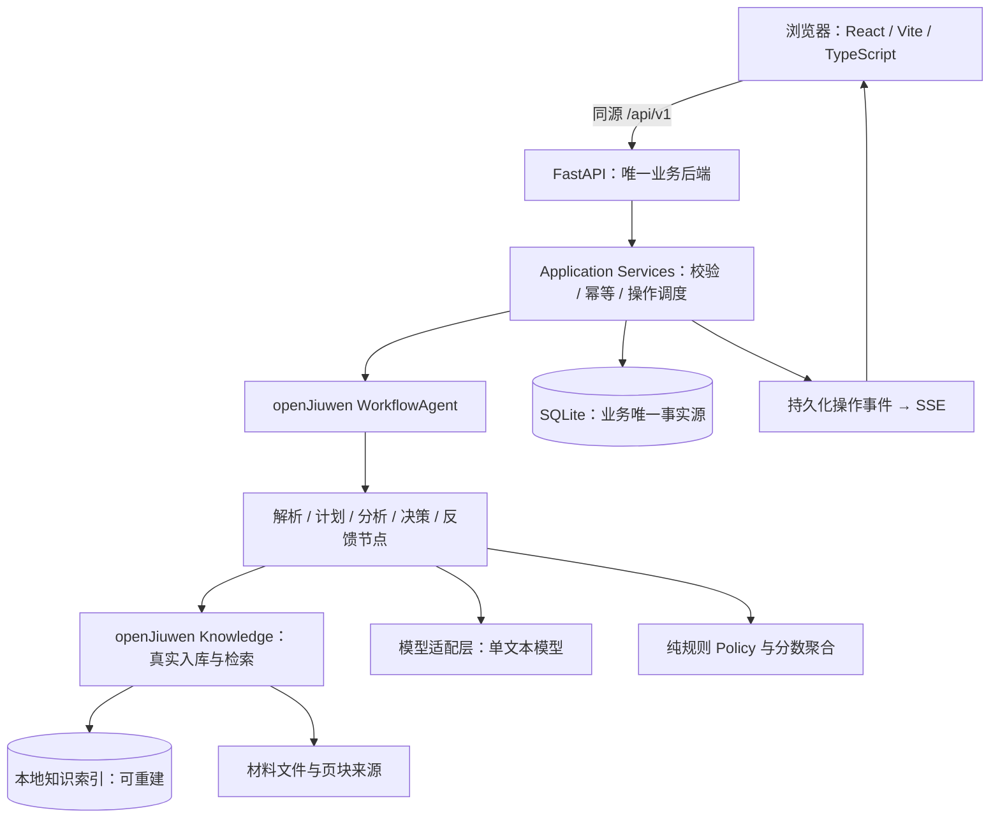

# 架构设计与技术栈

## 1. 架构决定

**新建轻量 Demo，而不是整站迁移。** 浏览器承担展示，Python 承担全部业务、持久化、模型调用与框架执行。默认不用 Next.js SSR/BFF，避免同时维护两个业务后端。旧 ZhiJue 仅按组件取用简历预览、样式或交互，不能默认沿用旧 API、状态恢复和数据库。

这是一项 Demo 工程取舍，不是在评价 Next.js 不适合此类产品。旧仓库存在 Next.js、Drizzle、SQLite 等依赖，但本轮没有运行旧项目；可复用程度必须逐组件验证。[S13]



浏览器等待用户是业务会话状态，不让一条长时间 HTTP 请求或 Workflow 一直悬挂。每次“准备面试、回答、结束”运行一个有界工作流；动作完成后状态落库，再等待下次用户事件。一个 WorkflowAgent 可以管理这些工作流；不把节点都包装成独立 Agent。

## 2. 技术栈冻结表

| 层 | 本版选择 | 限制与验证 |
|---|---|---|
| 前端 | React 19 + TypeScript strict + Vite + AnyUI 基础组件 + 普通 CSS 设计令牌 | 轻量 SPA，无 SSR、无第二套 UI 框架；业务组件由当前 OpenAPI/资源快照驱动 |
| Node | Node 24 LTS，pnpm 10 系列 | Node 官方当前将 24 标为 LTS；精确补丁与 pnpm 版本写入版本文件与 lock [S07] |
| Python | CPython 3.11 的维护补丁版本 + uv | openJiuwen 公开要求 ≥3.11 且 <3.14；不直接使用 Arch 系统 Python [S03] |
| Web API | FastAPI、Uvicorn、Pydantic v2 | 单进程；lifespan 管理 SDK、队列与关闭；同步重任务放受限工作线程/进程 [S08] |
| Agent | `openjiuwen==0.1.18` API 基线 + 固定兼容 commit | Workflow/WorkflowAgent 已有真实 smoke；Knowledge 全生命周期在 commit `72c49851` 上 VERIFIED；正式 0.1.18 wheel 仍缺该修复 [S03][S21][S23] |
| 领域持久化 | SQLAlchemy 2 + Alembic + SQLite | 仅 Python 迁移/写入；不保留 Drizzle 双写；每请求独立 Session [S12] |
| 指定 Knowledge | SimpleKnowledgeBase + 原生 MilvusVectorStore/Indexer | Milvus Lite + FLAT dense 的解析/入库/检索/重启/删除/删除后重启已 live 验证；没有本地替代 Knowledge [S04][S05][S21][S23] |
| Embedding | 负责人指定 BAAI/bge-m3，经 SDK OpenAIEmbedding 调用 | 合成文本 live 返回 1024 维；密钥仅本地 secret；网关内部模型映射未独立证明 [S20] |
| 文本 PDF | pypdf，按页提取并保留位置 | 扫描文本识别不是 pypdf 能力；按页判定，不一律 OCR [S09] |
| OCR | P1 独立 OcrAdapter | 选一个本地 OCR 实现，离线模型先准备；M0 不拉整套视觉依赖 |
| PDF 导出 | 前端可打印 HTML + 浏览器保存 PDF | 一套模板；不承诺服务端一键字节导出/复杂分页 |
| 测试 | pytest、HTTPX、Ruff、mypy；Vitest、Playwright | 真实框架 smoke 与 fixture 单测分开 |
| 部署 | 多阶段构建静态前端；单 Python 服务容器 | 默认绑定本机；Compose 管卷；公网与国产 OS 验收另有门槛 |

**不手工编造一份“已锁版本”的 lock 文件。** 工程 AI 必须在目标环境解析依赖、跑 smoke，再提交真实 `uv.lock` 与 `pnpm-lock.yaml`。不同版本文档中的 import 路径不能混用。

## 3. Knowledge 的确定路线与退出条件

优先验证 `SimpleKnowledgeBase → MilvusVectorStore/MilvusIndexer → 本地 .db URI`。官方 Milvus 文档支持本地文件 URI；openJiuwen 源码会将 URI 传给 MilvusClient，但这不能替代版本组合实测。[S04][S05]

M0 必须确认数据库使用 default、向量索引兼容 Lite 的 FLAT、维度与 embedding 一致，避免调用 Lite 不支持的数据库/分区管理、加载状态等接口。第一版只做 dense，不顺手启用 BM25/hybrid/GraphRAG。

如果原生组合因为 SDK/Lite 接口不兼容失败：记录准确报错与最小复现，至多一个有效工作日排查；随后通过 ADR 选择官方支持的其他本地方案或本地 Standalone。**不能悄悄把原生 Knowledge 替换成自己写的 FTS5 后继续声称合规。** 自定义 Knowledge 扩展只有在技术上真实接入且比赛口径可接受时使用。

这是本项目最大的技术门槛，应在写 UI 前发现。M0 失败不意味着其他模块都要重写，领域层只依赖 `KnowledgePort`。

**2026-09-18 初次实测：** 两个 synthetic profile 已通过真实 `parse_files → add_documents → retrieve`，并在新进程重建 Knowledge 后保持 provenance 与 KB 隔离；BGE-M3 实测 1024 维。当时正式 0.1.18 wheel 的 `delete_documents` 因 pymilvus 返回主键 list 而执行 `int(list)` 失败，删除后重启门槛未运行，故当轮保持 BLOCKED。[S20][S21]

**2026-09-19 解除结果：** 将官方 PR #1344 的两个提交原样落到 v0.1.18，并把项目锁到公开兼容 commit `72c4985111b835530ec616f70dd67117eb2e015c`。未修改 site-packages、未 monkeypatch、未替换 `SimpleKnowledgeBase`/Indexer/Store。修复前回归为 1 failed/1 passed，修复后同例 2 passed，上游目标文件 21 passed；随后两次四进程 live 均完成解析、入库、检索、重启、删除和删除后重启零命中。因此项目锁定组合的 M0-03 技术门槛为 VERIFIED；正式 0.1.18 发布包仍保留已知缺陷，不能把兼容 commit 描述为官方新发布版。详见 ADR-012。[S21][S23]

## 4. 模块职责与禁止依赖

| 模块 | 输入 / 输出 | 不得负责 |
|---|---|---|
| DocumentService | 文件/文本 → Document、SourceBlock | 给用户评能力、执行文件内指令 |
| ProfileService | 候选事实 → 用户确认快照 | 自动认定现实经历真实 |
| KnowledgeAdapter | 合法资料/检索请求 → 带来源结果 | 直接改变简历事实与评分 |
| PlanService | 资料/JD/已审核种子 → 五题计划 | 使用未审核生成题兜底评分 |
| Analyzer | 原始回答/Rubric/参考依据 → Observation | 直接写 DB 或选择下一题 |
| Policy | 已验证 Observation、计数器 → Decision | 调模型、读网络、按简历名字分支 |
| QuestionWriter | 已选种子/动作/允许事实 → 候选问题 | 自行扩大题目能力、添加真实经历前提 |
| EvaluationService | 条目评分 → 根问题反馈/总览 | 决定招聘或生成能力概率 |
| Resume/AnswerCoach | 允许事实 + 反馈 → 建议与待补项 | 自动采纳、补业绩/奖项/测量数据 |
| OperationService | 命令 → 可恢复操作与事件 | 把队列状态当面试事实 |

领域层不得 import FastAPI、openJiuwen 或数据库 ORM。应用层调用端口；适配层接 SDK/DB/模型。允许少量模块，不强行引入领域驱动设计框架。

## 5. 目标仓库结构

```text
zhijue-demo/
├── AGENTS.md / api.md / process.md / CHANGELOG.md
├── docs/                       # 本规范及 ADR、验收记录
├── apps/web/
│   ├── src/pages/              # /start、资料准备、正式面试三页
│   ├── src/components/         # common/layout/profile/prepare/interview
│   ├── src/hooks/              # Operation SSE + polling 生命周期
│   ├── src/api.ts              # 唯一浏览器 API 边界与 snake_case DTO
│   ├── src/{routing,storage,presentation}.ts
│   └── tests/                  # Vitest 网络与展示契约
├── services/api/
│   ├── src/zhijue/api/         # routes、DTO、异常映射
│   ├── src/zhijue/application/ # 业务用例、操作调度、事务边界
│   ├── src/zhijue/domain/      # 实体、Policy、计分纯函数
│   ├── src/zhijue/adapters/    # openjiuwen、llm、db、pdf、ocr
│   ├── src/zhijue/workflows/   # prepare、answer、finish、resume
│   ├── migrations/
│   └── tests/{unit,contract,integration_live}/
├── contracts/                  # 审核后的机器可读 Schema
├── prompts/                    # 提示词模板及版本登记
├── data/seeds/                 # 审核通过的题库，不含私人资料
├── data/knowledge/manifest.*   # 来源清单，非任意第三方全文镜像
├── eval/{dev,holdout,results}/ # 分离调试/保留集/结果
├── config/
├── scripts/                    # 可复现命令，不散落临时修复脚本
├── runtime/                    # gitignored：上传、库、索引、私有日志
├── Makefile / compose.yaml / Dockerfile
└── uv.lock / pnpm-lock.yaml
```

实际文档包只有规范、模板、示例；上述业务目录由 M0 创建。

## 6. 内部端口规范

下列是本项目接口语义，不是 SDK 中已有同名 API：

`KnowledgePort.ingest(document_snapshot) → index_receipt`

`KnowledgePort.retrieve(query, allowed_source_ids, profile_snapshot_id) → EvidenceChunk[]`

`AnalyzerPort.analyze(root_question, answer, assessed_criteria) → AnswerObservation`

`Policy.decide(context, observation) → PolicyDecision`

`WorkflowPort.prepare/answer/finish(command) → WorkflowResult`

端口返回结构必须带 schema_version。所有 side effect 由 Application Service 控制，不在纯 Policy 内写状态。

## 7. 运行与恢复

一次命令先落 Operation，再由生命周期管理的受限队列执行。持久化状态是事实，内存任务只是执行手段。SDK 运行时在 lifespan 初始化与关闭；文档解析/OCR 不能阻塞事件循环。[S08]

完成节点结果通过验证后，使用短事务提交回答观察、下一问题、revision 和事件。**不得在持有 SQLite 写事务期间等待 LLM。** 会话以 active_operation_id 和 expected_revision 控制并发，完成前不允许第二个评分操作。

进程重启时，queued 与 running 都转为 interrupted：两者依赖的 `BackgroundTasks` callable 都没有持久化，不能把 queued 假装成可安全自动重放。已保存 Answer 继续保留；answer/control 的可重试 operation 通过 parent-linked retry 恢复，其他命令由客户端重新发起新命令。不能承诺框架原生断点跨重启恢复，除非已经实测。

**M3/M4 后端实况（2026-09-19）**：`handle_answer` 使用项目锁定的 openJiuwen Workflow 真实执行 `Start → Analyzer → SemanticValidation → DeterministicPolicy → End`；不是本地同名替代。OpenAI-compatible 模型适配只读取显式指定、权限不宽于 0600 的私密 env 文件，最多三次总 transport attempt；`deepseek-flash` 已完成一次通过的 synthetic 业务分析。业务 Observation 在进入纯规则 Policy 前必须通过冻结 Rubric、ID、精确引文和 reference 语义校验。

Answer、Operation 与 Interview 受理状态原子落 SQLite；成功 Observation/Decision/下一题和 durable event 再作短事务提交。M4 的 `ReportingService` 只消费已持久化的冻结 Rubric 与 validated Observation：主答/追问按 criterion 合并，程序计算 coverage/score，在同一事务写每根 Assessment、唯一 Report、`report.ready` 和 completed 状态；读取报告不调用模型。skip/end 使用同一串行 runner，end 可在回答 operation 进行中先记录 `stop_requested`，等待回答安全释放后汇总。

运行中崩溃转 interrupted，retry 新建父子操作且复用 Answer 原文；若模型分析已成功而报告落库失败，retry 只重跑确定性汇总，不再次调用 Analyzer。SDK INFO 级输入/输出日志和 SDK 文件 sink 在业务应用中关闭，避免私人回答进入日志。实现仍是单进程 `BackgroundTasks` + 有界串行 runner，不宣称分布式队列或 exactly-once 上游计费。

## 8. 国产操作系统的边界

行业方案对该组别描述为基于国产操作系统的应用；具体命题只明确 SDK 与流程，二者之间的验收口径需确认。[S01][S02]

开发可继续在现有 Linux 环境；发布验证必须记录目标系统、架构、容器版本、依赖、启动/导入/面试/PDF 打印实测。不能把“Linux 能跑”直接写成“麒麟/统信/鸿蒙均已适配”。若用国产 OS 宿主跑容器，要明确宿主与容器用户空间，避免偷换概念。


## M0 局部运行事实（2026-09-18）

架构图仍是目标，不是已实现拓扑。当前可运行的只有 services/api/smoke/ 独立探针：

```text
run_workflow → 官方 Workflow.invoke + create_workflow_session
run_agent → 官方 WorkflowAgent.invoke
          → legacy ControllerAgent.invoke → WorkflowController
          → Runner.run_workflow_streaming → 官方 Workflow
两路图：Start → TransformText（纯文本测试节点）→ End
```

运行时 MRO 为 WorkflowAgent → legacy ControllerAgent → legacy BaseAgent → ABC → object；这不代表已适配任何比赛专用 Base Agent，也不等于验证了新版 single_agent.agent.BaseAgent。使用官方入口，没有复制或改写 SDK；具体源码绝对路径与 SHA256 保存在 smoke JSON。

任务组使用 SDK get_task_manager().task_group 管理，保证探针超时后取消后台节点；当前每次创建新图和 session，不声称持久恢复或业务幂等。日志通过官方配置 API 仅写控制台，归档到被忽略的 runtime/。

M0-BASE 仍 BLOCKED；Knowledge 的解析/入库/检索/重启/删除/删除后重启已在锁定兼容 commit 上 live 实测，LLM 仍 NOT_RUN。今后若发现官方指定宿主，应在该宿主挂接既有证据、状态、计划、分析、策略、评价能力；Memory 仍 P1。不平行新建 Agent，不推翻单 Python 写入方。


### M0-BASE 来源核验补充（2026-09-18）

本轮没有调整架构或实现。锁定发布包 0.1.18 的 7 个入口/调度/session 源文件已与 uv.lock 指定 wheel 逐字节核对，并复跑原 smoke；对外说明只覆盖该局部真实路径。官方仓库固定 commit 与 wheel 有 2 个审计文件不同，不混用新增 name/trace_id 等参数；官方通用 notebook 的旧导入也不能直接当作当前 SDK API。详情见 docs/14-sources-and-rules.md。

未取得官方答疑正文（HTTP 418），故仍不确认专用 starter/Base Agent 要求；该段核验当时 Knowledge/业务链未跑，后续 M0-03 只补上 Knowledge 读路径，删除与业务链仍未完成。不得将“源码可追溯”替换为“赛事全部合规”，不得因此自动进入下一阶段。
