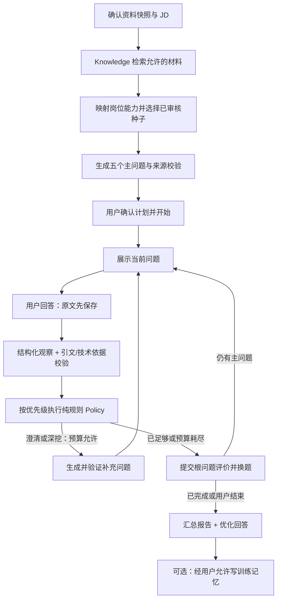

# 工作流、状态机与策略规范

## 1. 工作流划分

一个业务 Interview Agent，四个有界工作流：`prepare_interview`、`handle_answer`、`finish_interview`、`compose_resume`。材料解析/入库由真实 Knowledge 适配参与，不只在页面上画节点。

## 2. Interview 状态

| 状态 | 允许动作 | 转移 |
|---|---|---|
| preparing | 查看操作、删除资料 | 准备成功→ready；失败→prepare_failed |
| prepare_failed | 重试操作、查看原因 | 重试成功→ready |
| ready | start、end | start→active；end→finishing |
| active | answer、skip、end | 回答中保持 active 且设置 active_operation_id；最后→finishing |
| finishing | 查看操作 | 成功→completed；失败→finish_failed |
| finish_failed | 重试报告、查看已保存回答 | 重试成功→completed |
| completed | 只读、另开一场 | 不允许追加回答或静默改旧报告 |

不存在“用客户端当前页面 stage 决定系统 Prompt”的设计。服务端状态是准绳。刷新不是一种业务动作；离开页面不等于停止远端操作。

## 3. Operation 状态

`queued → running → succeeded / failed / interrupted`。删除资料导致执行被阻止可记 canceled。所有终态不可再原地运行；retry 创建新的 operation_id 与 parent_operation_id。

事件可以被客户端多次收到，但逻辑状态变更只能提交一次。外部模型调用不能保证绝对 exactly-once；网络中断可能已计费但没拿到结果。系统保证的是业务提交幂等，并记录可能重复的上游费用，不作无法实现的承诺。

## 4. 五个主问题怎么选

先将 JD 的 must-have 与 nice-to-have 转为最多六个演示能力维度；权重先采用 3/1 的离散值，来自明确 JD 标记或人工确认。没有明确标记就使用岗位预置，并说明是预置。

在已审核种子中选择五个不同 root topic；至少三个能力维度；优先目标岗位的必要能力，兼顾一题项目贡献/排障叙述。不按姓名、特定比赛名、简历文件名或预录回答选题。

每个题目绑定 basis_type：

- resume：只能引用已确认原文事实，不能替候选人补技术或业绩。
- jd：用“假设/工作任务”问法；不暗示候选人已经做过。
- gap：只表示材料没有体现要求，考可迁移思路；不能声称候选人不会。

没有可用技术参考/种子时不临时生成“权威技术题”。可以退回经历表达题并降低技术评价范围，仍保留清楚的依据标签。

## 5. Policy 动作与含义

P0 只允许 `CLARIFY / PROBE / NEXT / END`。反事实/边界挑战是 PROBE 的子意图，不额外增加一种 Agent 或状态；P1 再扩动作需要 ADR。

**关于 CHALLENGE 的正式说明（ADR-013）**：负责人追加约束提到第一版动作集包含 `CHALLENGE`。当前契约（`contracts/policy-decision.schema.json`、事件 payload 枚举、本文档优先级表）只允许四动作，校验器另有负例断言"P0 没有 CHALLENGE 动作"。按"不静默扩枚举、不为通过校验放宽标准"的原则，本包**保持四动作**，把 CHALLENGE 需要表达的语义落在 `PROBE + target.followup_intent=counterfactual`（见 §7 的反事实边界）。要真正启用独立 CHALLENGE 动作，须走新 ADR 并同步事件 payload、恢复逻辑与策略测试（ADR-013"何时重开"）。

| 优先级 | 条件 | 动作 | 说明 |
|---:|---|---|---|
| 0 | 用户明确结束 | END | 不为凑五题阻止退出，报告 incomplete |
| 1 | 资料已删除/模型输出无效 | 不生成业务 Decision | 操作失败或中断，不能把技术故障当作用户能力差 |
| 2 | 当前问题被跳过 | NEXT | 不打零分，记录 skipped |
| 3 | 当前根问题已有一次补充 | NEXT | 无论模型多想追问都停止，保留未验证项 |
| 4 | 回答偏题、指代不明、材料冲突 | CLARIFY | 一个短问题；资料冲突不直接扣分 |
| 5 | 被明确问到的关键点不足，且存在合法追问 | PROBE | 只追一个最重要缺口，不一次问三件事 |
| 6 | 本轮证据已足够或没有有价值的合法追问 | NEXT | 不为了展示智能硬追问 |
| 7 | 无剩余主问题 | END | 完成后进入报告 |

优先级 7 是 NEXT 的最终化处理：NEXT 发现无剩余主问题时落 END。以上规则顺序必须写成纯函数测试，不让 LLM 返回一个 action 直接执行。

## 6. 正确的循环顺序

`验证命令 → 保存原回答 → 获取题目固定 Rubric/参考 → 模型生成 Observation → 来源与语义验证 → 计算临时 Assessment → Policy → 生成/校验下一问 → 单事务提交观察、决策、状态与事件`。

原回答首次接受即入库，因此上游失败后不要求用户重打。待处理答案有 processing/failed/evaluated 状态，retry 不再创建同一份 Answer。若候选问题生成失败，保留观察草稿，操作重试可复用已验证检查点，不能重复给同一答案扣分。

根问题评价由主回答与补充回答合并产生，根权重只算一次。优化示例与提示之后的复述不回写原始表现。

## 7. 追问的内容边界

例：用户说“我们加了锁”。只有在原题确实询问共享资源处理时，才能判断回答过于概括。不能凭这句话认定已经掌握互斥，也不能判定不会。

合理追问：“这个锁具体保护哪段访问过程？”

不合理追问：“你们既然通过互斥锁解决了中断并发、降低延迟 30%，为什么不用无锁队列？”——前提、效果、方案均可能是系统补出来的。

一个补充问题只能有一个核心目的；给出必要的假设边界。没有被确认使用 RTOS 的裸机项目，不能自动问“你使用的 FreeRTOS mutex 为什么这样配置”；只能改为明确假设题。

当前 M3 的 PROBE 文案不再另调模型自由发挥：程序从已校验 Decision 的唯一 `criterion_id` 找到根问题冻结 Rubric，以该 criterion 的合格阈值描述作为候选人可理解的追问焦点，并按 `followup_intent` 组织一句问题。找不到合法焦点时才使用意图级通用文案；CLARIFY 因没有 criterion 目标，只询问指代或冲突。任何内部 criterion ID 都不进入候选人文案。

## 8. 时间、调用与终止预算

业务默认值来自 `config/demo.yaml`，不要散落 magic number。

五主问题、每根一次补充（CLARIFY 也占额度）。每个逻辑操作累计最多三次模型尝试，共享语法修复与网络重试预算，不能三层各重试三次。

15 分钟为软提示；用户同意继续才继续。每轮操作硬超时 60 秒；对资料解析、报告、OCR 使用各自配置。预算结束应产生明确状态，不使用模型的“我面试完了”自由文本标记驱动转移。

## 9. Memory 的 P1 边界

只有被明确考察且有回答证据的训练缺口才可写入。`unassessed` 不写弱项，unknown 新技术不写“技术差”。记忆内容是“上次在该题中没有解释某机制”，不是“此人能力差”。

第二场可将一到两个历史训练项纳入五主问题，仍保留至少三个相关维度，不整场重复弱项。同一道题经提示之后重答提高分数不等于能力提升；用平行问题验证迁移，并保留题目难度、提示状态。

## 10. 决策可观测性

Decision 展示 `action + reason_code + 支持引用 + 下一目标`。这是应用结构化决策记录，不是模型隐藏思考过程。每条记录含 policy_version 与 run_id，供复现规则测试。

## 11. 运行中主动结束与版本冲突

用户在模型分析期间点击结束，服务端在短事务中设置 `stop_requested=true`，保存唯一结束 operation 和 observation_id=null 的 `USER_REQUESTED_END` Decision，并增加 revision。InterviewView 立即停止暴露待答问题，但不伪称远端请求已经取消。

当前回答可安全保存的原文、validated Observation 和程序 Decision 继续落库；提交时看到 stop_requested 后不得创建或展示下一题。串行 runner 随后执行结束 operation，按最终已持久化状态生成报告。结束不保证上游取消或退费，重复 end 返回同一 operation；失败后通过 parent-linked retry 恢复，不新建第二份报告。

skip 只在没有 active operation 时受理。跳过主问题产生 `status=skipped / score=null`；跳过追问保留该根题已有 Observation，但全场 completion 仍为 incomplete。skip/end 都不调用模型，不把用户跳过写成回答错误。删除仍优先于结束：被删除档案的结果不得回写。

这是单进程的业务协调，不是分布式任务系统。`BackgroundTasks` callable 不持久化，因此重启时 queued 与 running 均标 interrupted；已保存 Answer 不丢失，用户读取状态后明确重试或重新发起命令，不能静默双重执行。

## 12. M3/M4 后端落地状态（2026-09-19）

`handle_answer` 已通过已安装的 openJiuwen 构造成有界 `Start → Analyzer → 语义校验 → 纯规则 Policy → End` Workflow。Analyzer 只能返回 Observation 候选；服务端逐项校验 observation/answer/question/root ID、回答原文精确引文、冻结 Rubric 的 criterion/kind/weight 和审核 reference，再由程序产生 Decision。模型输出中的 action、额外字段、伪造引文或越界 reference 均使 operation 失败，不形成能力结论。

开始面试会把五个冻结 slot 一次性实例化为 Question；批准 Seed 仅作精确 competency 匹配，唯一允许的宽映射是 `embedded.rtos.fundamentals → embedded.rtos.*`，且单场 Seed 不重复。无匹配时使用 `seed_id=null` 的非技术经历/证据回退题。

PROBE 文案由选中的最重要缺口和冻结 Rubric 确定性渲染，不新增第二次模型调用。M4 已实现根题汇总：主答/追问按 criterion 合并，重复复述不增加权重；supported 与 contradicted 并存时保留 disputed；coverage 低于 60%、未测、跳过或冲突均保持 null。至少三根 scored 根题才按等根权重生成 overall_score，JD priority 不参与计分。

回答受理在同一 SQLite 事务写入 Answer 原文、operation、`active_operation_id` 和 revision；成功后再以短事务写 Observation、Decision 和下一状态。自然 END 或 control END 通过 ReportingService 在同一事务写五个唯一 Assessment、唯一 Report、`report.ready` 和 completed。若 Observation 已提交而报告落库失败，retry 复用现有 Observation，只重跑确定性汇总，不再次调用 Analyzer。

应用把 openJiuwen 运行日志提升到 WARNING 并禁用 SDK 文件 sink，避免 INFO 级 workflow 输入/输出把回答或简历写入日志。Operation 的公开错误只使用固定契约文案，内部异常不得把 SQL 参数或回答原文带回 API。M3-01 已用 `deepseek-flash` 完成一次通过的 synthetic 业务分析；M4-01 本轮报告验证使用 fixture Analyzer，但真实 openJiuwen Workflow、SQLite、Operation、评分和报告代码均未替换。它证明程序边界，不证明真实模型评分效果、价格或 p95。
