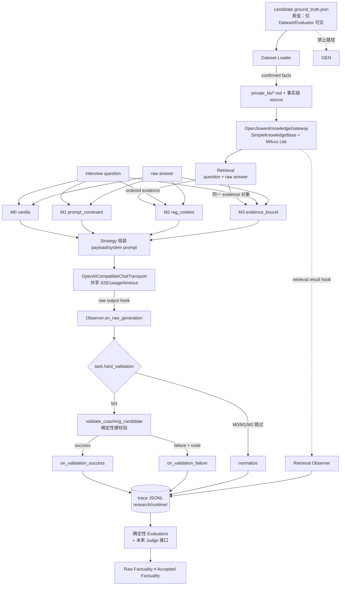

# DESIGN｜Candidate Evidence Fidelity 研究基础设施设计

版本 `1.0.0`；施工分支 `research/candidate-evidence-fidelity-v1`（基线 `d91023a`）。
本文件是研究侧唯一设计真源。所有"当前能力"结论来自逐行读源码，不来自 README 推断。

---

## 1. 研究问题与被试变量

> 给定候选人的私人事实、面试问题与原始回答，LLM 在优化回答时是否会**新增、扩大、
> 混淆或篡改**候选人事实？用户确认事实、显式证据上下文、来源绑定与确定性校验，
> 分别能把事实漂移降低多少？

ZhiJue 只是实验台。唯一被试对象是 `coach_answers`（面试回答优化）任务。

- 自变量：事实约束强度（M0 无约束 → M1 自然语言禁令 → M2 RAG 证据 → M3 证据绑定 + 硬校验）。
- 常量（必须逐字节相同）：model、temperature、reasoning_effort、timeout、max_tokens、
  top_k、检索 query、ordered evidence、每 cell 生成次数、输入 case。
- 因变量：Raw Generation Factuality（模型本意）与 Accepted Output Factuality / Pass Rate
  （系统最终拦截结果）。**两者禁止混算**：M3 的 validator 拒绝不消灭"模型试图编造"这一事实。

不研究：出题算法、动态追问、评分算法、OCR、多用户、UI、Seed 扩充、部署、Agent memory、
Technical KB 正确性。

---

## 2. 当前能力（源码事实）

### 2.1 `application/content_generation.py`

`_load_coaching_context()`（165-241）产出 payload：

| 字段 | 来源 | 语义 |
|---|---|---|
| `report_id` | Report | 校验回指 |
| `answers_by_root` | Answer 表，按 `Question.root_id` 聚合 `{answer_id: raw_text}` | 主答 + 追问同根 |
| `root_questions` | `kind=="main"` 且有回答的根题 wording | 题面 |
| `allowed_claims` | `_claims_for_snapshot(session, snapshot)` → `{claim_id: text}` | 当前**不可变 ProfileSnapshot** 内全部已确认事实 |

`process_coaching()`（253-332）：一次 `run_grounded_content_workflow` 覆盖**全部 root**；
`ModelRequestTimeoutError` → 超时型 UpstreamError，其余（`ContentWorkflowError` /
`GroundedContentValidationError` / `ModelRequestError`）统一折叠为
`"回答改写失败，原回答和评分未改变。"`；成功才写 `report.improved_answers`、
`improvements_status="ready"`、`run_metadata.content_generation`（usage）。

### 2.2 `application/content_workflow.py`

真实 openJiuwen 图：`Start → generator → semantic_validation → End`（`WorkflowCard`
input_params 只允许 `task`、`payload`）。

- `_GeneratorComponent.invoke`：调 `generator.generate(task=…, payload=…)`，
  要求返回 `AnalysisResult`，输出 `{content, usage}`。
- `_GroundingValidationComponent.invoke`：`_parse_json_object`（拒重复键、拒非有限数）→
  按 task 分派 `validate_claim_extraction_candidate` / `validate_coaching_candidate` /
  `validate_resume_candidate`；捕获 `ContentWorkflowError, GroundedContentValidationError,
  KeyError, TypeError` 后 `raise ContentWorkflowError("generated content failed contract
  validation") from None`（刻意不让模型文本进 SDK 异常记录）。
- `run_grounded_content_workflow(*, generator, task, payload, timeout_seconds=60)`：
  `_invoke_bounded` 超时；异常经 `_workflow_contract_error` 归一；`_checked_output` 断言
  信封严格为 `{"output": {"candidate": dict, "usage": {input_tokens, output_tokens,
  total_tokens, cost}}}`。
- **当前没有任何扩展点**（无回调、无 observer、无事件）。

### 2.3 `domain/grounded_content.py`

`validate_coaching_candidate()` 判定顺序（每条一个固定英文消息，全部 fail-fast）：

1. `_validate_schema(candidate, "coaching-result.schema.json")` → 非对象或 Schema 不符。
2. `document["report_id"] != report_id`。
3. 逐 item：重复 root → `duplicate coaching root question`；
   root 不在 `answers_by_root` → `coaching referenced an unknown root`。
4. 逐 segment、逐 source_ref：
   - `answer_quote`：`answer_id` 不在同根回答内，或 `exact_quote` 不是该回答的逐字子串
     → `coaching answer quote is not verbatim`；
   - `claim`：`claim_id` 不在 `allowed_claims` → `coaching referenced a claim outside the snapshot`。
5. `_reject_unbound_assertions(segment.text, segment_sources)`：
   - 新增数字（`_NUMERIC_FACT` 差集）→ `introduced an unbound numeric fact`；
   - 新增高风险断言（`_HIGH_RISK_ASSERTIONS`：主导/负责/牵头/独立/解决/提升/降低/优化/
     实现/完成/设计/开发/搭建 + led/lead/owned/responsible/independently/solely/solved/
     improved/reduced/optimized/implemented/completed/designed/developed/built）；
   - 新增技术 token（`_TECHNICAL_TOKEN` 差集）→ `introduced an unbound technical token`。
6. `"".join(segment_texts) != item["rewritten_answer"]`。
7. `set(item["used_claim_ids"]) != claim_ids`。
8. `set(items_by_root) != set(answers_by_root)`（覆盖度）。

### 2.4 Knowledge 链

- `adapters/knowledge.py`：`KnowledgeSettings`（`embedding_provider` 必须是
  `openjiuwen_api`；`embedding_api_base` 必须是 `https://host/v1`，路径写死等于 `/v1`；
  `embedding_timeout 1..120`；`embedding_max_retries 1..3`；
  `embedding_expected_dimension 1..65536`，默认 1024），`load_settings()` 强制 0600；
  `build_embedding()` → openJiuwen `OpenAIEmbedding`（`max_batch_size=8`、`max_concurrent=2`）；
  `build_knowledge_base()` → `SimpleKnowledgeBase` + `MilvusVectorStore`/`MilvusIndexer`
  （Milvus Lite 本地文件）+ `CharChunker(300/40)`，注释明确"无同名本地替身"。
- `OpenJiuwenKnowledgeGateway.index_snapshot(profile_id, generation, sources)`：
  `Document(id_=source.source_id, text, metadata{source_id, profile_id, generation,
  data_mode})` → `add_documents` 返回 ID 必须逐一相等 → **逐源回查回执**（命中同
  `source_id` 且前 20 字符互为子串）→ `ActivationReceipt`；统计 `embedding_logical_calls`。
- `search(profile_id, generation, allowed_source_ids, query, top_k)`：
  `_retrieve(kb, query, top_k=max(top_k, self._top_k))` → 过滤 allowlist 外来源 →
  `[{text, doc_id, source_id, generation, chunk_id, score}][:top_k]`。
- `application/profiles.py::search_knowledge(snapshot_id, query, top_k)`：
  按快照解析 `profile_id` / `generation=snapshot.id` / `allowed_source_ids`，未配网关直接抛错。
- `KnowledgeSource(source_id, text)` 是极简索引单元 → 事实级索引天然可用。

### 2.5 `adapters/model.py` transport

- `ModelSettings`：0600 env 文件、HTTPS、**禁止任何 URL 路径**
  （`if parsed.path or parsed.query or parsed.fragment: raise`，
  `tests/unit/test_answer_workflow.py` 把 `https://model.example/v1` 断言为应拒），
  `model_max_retries ≤ 2`、`reasoning_effort ∈ {none,low,high,max}`、
  `model_stream_stall_seconds` 块间静默预算。
- `OpenAICompatibleAnswerAnalyzer` 内含真正的 transport：
  `_request_payload`（`temperature:0`、`reasoning_effort`、`response_format:json_object`、
  system + 单条 JSON user）、`_post_once`（`stream:True` + `stream_options.include_usage`、
  `httpx.AsyncClient(follow_redirects=False, trust_env=False)`、`asyncio.timeout(model_timeout)`、
  connect ≤10s、read = min(stall, timeout)、非 2xx → `ModelRequestError`）、
  `_collect_stream`（只取 `delta.content`，**丢弃 `reasoning_content`**，必须有 `[DONE]`，
  空内容报错，usage 取最后一个带 usage 的 chunk）、`_parse_response` → `AnalysisResult`。
- `OpenAICompatibleContentGenerator` 通过私有属性复用：
  `self._transport._client / ._post_once / ._parse_response`。
- `AnalysisResult` 是 `@dataclass(frozen=True, slots=True)`，字段仅
  `content / input_tokens / output_tokens / total_tokens / cost`；`usage()` 键集固定四个，
  `_checked_output` 按这个键集断言 → **不能往 usage 里塞新字段**。

### 2.6 网关实测事实（2026-09-24，本机，synthetic 输入）

- discovery 网关（kimi-k2.6）：仅 `/v1/chat/completions`；`/chat/completions` 404；
  **`/v1/embeddings` 404，模型目录无任何 embedding 模型**；SSE + `include_usage` 与
  现有 `_collect_stream` 完全兼容；`reasoning_effort` 被真实校验（非法值 400）；
  `low` 时 content 干净，`none` 时**思维链漏进 content**；`max_tokens` 生效，过小则
  `content:null`；usage 无价格字段。单 root 真实形状调用：56.4s，545/5046/5591 tokens。
  目录价 $6.5/M in、$27/M out（推导价，非账单）。
- siliconflow embedding：`Qwen/Qwen3-VL-Embedding-8B`，openJiuwen `OpenAIEmbedding`
  实测 `dimension=4096`，`embed_documents(10)` 0.48s，`embed_query` 0.66s。
- 简历 PDF（千早爱音，负责人定性为**虚构演示材料**）：1 页、215KB、pypdf 直抽 1655 字符
  （文本型，非扫描）、1 张内嵌图片、sha256 前缀 `7bf9d1b9`。文件与正文不入 Git。

---

## 3. 缺失能力（研究所需，当前不存在）

| # | 缺口 | 后果 |
|---|---|---|
| G1 | 无证据检索步：coaching payload 是"快照全量事实" | 无法研究 RAG 上下文的效应，无法区分 Retrieval Failure 与 Generation Failure |
| G2 | 无 raw output 保留：校验失败即丢，只留固定错误串 | 无法度量 Raw Generation Factuality，也无法报告拒绝原因 |
| G3 | 无 observer/事件点 | 任何旁路记录都只能改业务流程 |
| G4 | 校验失败无机器可读分类（只有英文消息文本） | reason 只能靠字符串匹配，脆 |
| G5 | transport 藏在 `OpenAICompatibleAnswerAnalyzer` 内，generator 靠私有属性复用 | 研究 runner 无法在不自建 HTTP 的前提下复用同一 transport |
| G6 | 无 `finish_reason` / 无 `max_tokens` 下发 | 截断与模型乱写不可区分，且无法固定生成长度预算 |
| G7 | API_BASE 禁路径 | 只能路径前缀路由的网关（本例 `/v1`）接不上 |
| G8 | 无 candidate 级 ground truth / 无 case 级 evaluator 标签 | 无真值即无事实漂移度量 |
| G9 | 无 trace JSONL / 无实验配置指纹 | 结果不可复现、不可审计 |
| G10 | 无跨项目泄漏、时间漂移、职责扩大等检测器 | taxonomy 无法落地 |

---

## 4. 本次改造边界

### 4.1 业务侧允许改的（且只有这些）——R1 已全部实施，见 §15

| 变更 | 约束 | 等价性证明 |
|---|---|---|
| B1 新增 `adapters/chat_transport.py`：`OpenAICompatibleChatTransport` | 职责仅 messages/model/temperature/reasoning_effort/response_format/max_tokens/timeout/SSE/usage；`AnalysisResult` 返回；HTTPS、`trust_env=False`、`follow_redirects=False`、stall、`[DONE]` 语义、reasoning 丢弃全部照旧 | `tests/test_chat_transport_regression.py`：同一 settings 下，与 `d91023a` 抓取的请求/响应样本逐字段比对（URL、headers 名集、payload JSON、SSE 解析结果、异常类型） |
| B2 `OpenAICompatibleAnswerAnalyzer` / `OpenAICompatibleContentGenerator` 改为持有 transport | 公开签名不变；不再访问私有属性 | 现有 324 条测试全绿 |
| B3 `GroundedContentValidationError` 携带 `code` | **消息文本逐字节不变**；生产仍 fail-fast 抛第一个 | 现有断言 `pytest.raises(match=...)` 全绿 + 新表驱动测试逐条对照 code |
| B4 `ContentWorkflowObserver` Protocol + `build_*`/`run_*` 可选 `observer=None` | 只观测；观察者异常被吞并计数；不改输入/输出/状态/异常 | `observer=None` 路径与 B1 前的输出、异常、SDK 组件名逐一相同；观察者抛异常测试证明业务结果不变 |
| B5 `ModelSettings.api_base` 允许**受控路径前缀** | 仍强制 HTTPS、无 userinfo、无 query、无 fragment、无控制字符；路径必须匹配 `^(/[A-Za-z0-9][A-Za-z0-9._~-]*)*$`（无 `..`、无尾斜杠、总长 ≤ 256） | 更新 `test_model_settings_reject_unsafe_or_unbounded_values`：`https://model.example/v1` 移入接受例；`http://`、`user:pw@`、`?x=1`、`#f`、`//p`、含空白全部仍拒 |
| B6 `AnalysisResult.finish_reason`（可选、默认 None） | 不进 `usage()`，不进任何持久化字段 | `_checked_output` 键集断言不变 |

生产行为必须保持：`_GroundingValidationComponent` 仍把一切具体失败模糊成
`generated content failed contract validation`；`process_coaching` 仍折叠成同一 UpstreamError；
API 响应、SSE 事件、OpenAPI、数据库、前端**零变化**。

### 4.2 全部新增都进 `research/`

零业务表写入、零 migration、零 OpenAPI 改动、零前端改动。研究只用
`research/runtime/`（Git 忽略）。

---

## 5. 架构



不变式：

- **I1** Ground Truth / `evaluator_only` / trap claims 不存在任何指向 Strategy 或 Transport 的边。
  守卫实现为"可见性投影 + 出口扫描"两道，见 §9。
- **I2** Observer 只有 `on_*` 入参，返回值一律忽略；异常只递增 `suppressed_failures`。
- **I3** 一个 cell 的生成次数 = `generation_attempts`（默认 1）。validator 拒绝**不触发**重调。
- **I4** M2 与 M3 拿到的 evidence 是同一个对象（同 query、同 top_k、同序）。
- **I5** 同一比较组内 transport 参数逐字段相同；差异只在 prompt 与 post-processing。
- **I6** trace 缺失数据只能是 `null`，不得估造。

---

## 6. 数据契约

### 6.1 目录形态

```
research/data/candidates/candidate_017/
├── ground_truth.json          # 唯一真值；禁止入 Prompt、禁止入 RAG index
├── private_kb/
│   ├── resume.md              # 由 GT 生成的自然语言材料
│   ├── project_notes.md
│   └── profile_notes.md
├── interview_cases/
│   ├── case_001.json          # question + raw answer（含 evaluator_only）
│   └── case_002.json
└── optional/resume.pdf        # 可选原件；不入 Git
```

**先有 GT，后有自然语言材料**：`private_kb/*.md` 由 `ground_truth.json` 的 facts 投影生成，
生成关系记录在 GT 的 `derived_materials[]`。禁止反向"从简历里猜真值"。
唯一例外：负责人提供的既有 PDF（千早爱音，定性为虚构演示材料）走
`provenance.kind = resume_document` 的人工逐字转录路线，并在 `derived_materials[]` 标注
`status: transcribed_from_existing_document`，不伪装成先验真值生成。

### 6.2 关键 schema（`research/contracts/`）

- `candidate-ground-truth.schema.json`：`facts[] = {fact_id, context_id, predicate, value,
  polarity, confirmed, provenance{kind, locator, verbatim, verbatim_sha256}}`；
  `predicate ∈ used_technology | responsibility | outcome | metric | project_time |
  learning_status | tool_used | team_size | personal_scope | other`；
  `trap_claims[]`（仅 evaluator 可见）、`derived_materials[]`。
- `interview-case.schema.json`：生成可见 `{case_id, candidate_id, split, question{wording,
  competency_tags, source_seed_id}, raw_answer{text, turns}, retrieval_query_spec}`；
  evaluator-only `{expected_evidence_fact_ids[], injected_drift[{label, fact_id, note}],
  answer_style_rating}`。
- `research-trace.schema.json`：见 §8。

三份 schema 都 `additionalProperties: false`，未知字段直接判失败——契约漂移必须响亮失败，
不允许"看起来成功"。

---

## 7. 四种 Method Strategy

统一接口：

```python
class CoachingMethod(Protocol):
    method_id: str
    task: MethodTask          # answer_only | answer_with_evidence | evidence_bound
    def build_request(self, cell: ExperimentCell) -> MethodRequest: ...
    def postprocess(self, cell, request, raw: AnalysisResult) -> MethodOutcome: ...
```

`MethodRequest` 携带 `system_prompt`、`user_payload`、`evidence`（可空）、`hard_validation`。
Runner 只把 `system_prompt + user_payload` 交给 transport，`postprocess` 阶段才可能校验。

| | M0 `vanilla` | M1 `prompt_constraint` | M2 `rag_context` | M3 `evidence_bound` |
|---|---|---|---|---|
| 输入 | question + raw answer | 同 M0 | + 检索证据 | 与 M2 完全相同的证据对象 |
| 反编造禁令 | 无 | 自然语言禁令（不得新增经历/技术/职责/数字/结果/因果） | 同 M1 | 同 M1 |
| RAG | 无 | 无 | 有 | 有（同一 ordered evidence） |
| 来源绑定要求 | 无 | 无 | 无 | 每个事实 segment 必须引 answer 逐字引文或候选事实 source |
| 确定性硬校验 | 无 | 无 | 无 | 有（复用 `validate_coaching_candidate`） |
| `generation_attempts` | 1 | 1 | 1 | 1（**拒绝不重调**） |

共享事实（消除混杂变量）：

- **JSON 信封恒定**：四方法都要求 `{"rewritten_answer": "...", "items": [...]}` 形式的最小
  JSON（`response_format: json_object`）。这是**格式常量**，不是事实约束；M0 仍是"无
  anti-hallucination constraint / 无 source binding / 无 validator"。理由：否则 M0 的自由文本
  需要额外的解析步骤，把"能不能解析"混进"有没有编造"。
- M3 的 `user_payload` 复用生产字段名（`report_id` / `answers_by_root` / `root_questions` /
  `allowed_claims`），其中 `allowed_claims` 填**检索到的候选事实**（`source_id` 反解回
  `claim_id`），使 `validate_coaching_candidate` 原样可用：answer 逐字引文 ↔ 候选事实引用
  都是合法来源，`used_claim_ids` 与实际引用必须一致，未引用即判失败。
- M3 的 validator 是"接受门禁"，不是"事实性真值"。论文的模型编造倾向由 §11 的确定性
  evaluator 在 **raw output** 上判，与 validator 是否放行无关。
- 生产 prompt（`COACHING_SYSTEM_PROMPT`）不用于 M0-M3：它自带完整事实约束，属于 M3 家族。
  版本另登记，避免"顺手复用生产 prompt"造成方法定义漂移。

---

## 8. Research Trace（JSONL，一行一个 `case × method × model`）

`research-trace.schema.json` 字段（`additionalProperties: false`，未知值必须 `null`）：

```
schema_version, run_id, experiment_key, case_id, candidate_id, domain, split,
method_id, task, provider, model, model_fingerprint, prompt_version, prompt_hash,
input_hash, evidence_input_hash, retrieval{config, query, query_hash, top_k,
hits[{rank, source_id, fact_id, generation, chunk_id, score, text_hash}],
expected_evidence_fact_ids, recall_at_k},
raw_output{content, finish_reason, truncated, parse_status},
normalized_output, validation{status, reasons[], accepted},
latency_ms, input_tokens, output_tokens, total_tokens, cost, cost_basis, attempts,
observer_failures, created_at
```

- `experiment_key = sha256(canonical_json{case_id, method_id, model_fingerprint,
  prompt_version, config_fingerprint, dataset_version, split})`；
  `run_id = "r_" + experiment_key[:16]`。同一配置重跑得到同一 key（可复现、可去重）。
- `model_fingerprint`：provider/model/temperature/reasoning_effort/max_tokens/timeout/
  stall/attempts 的规范化 hash；**不含密钥**。
- `cost` 只允许两个来源：provider 返回（当前恒缺 → `null`，`cost_basis="provider"`），
  或目录价推导（`cost_basis="catalog_price"` 且必须同时存 `price_per_million_*`）；
  缺数据一律 `null`，不填 0。
- 明文红线：trace 里可以存模型原文与候选事实文本，但**不得**存 API key、Authorization、
  dotenv 内容、`reasoning_content`、ground truth、trap claims、evaluator 标签。
  `tests/test_no_ground_truth_leakage.py` 同时扫描 model input 与 trace 落盘内容。

---

## 9. 防污染守卫（§17 九条 → 具体机制）

| 规则 | 机制 | 测试 |
|---|---|---|
| 1 GT 不进 Prompt | Loader 只暴露 `GeneratorView`（`case.as_generator_view()`），`GroundTruth` 类型不出 dataset 模块；Transport 出口做字节级扫描 | `test_no_ground_truth_leakage` |
| 2 trap claims 不进 Prompt | trap 只存在于 `EvaluatorView`；生成路径无该类型引用 | `test_trap_claims_not_in_model_input` |
| 3 evaluator 输出不反馈 generator | Method 无 evaluator 入参；Runner 单向 `generate → validate → trace → evaluate` | `test_evaluator_output_not_reachable_by_method` |
| 4 M2/M3 同一证据 | Runner 每 cell 检索一次，同一 `EvidenceSet` 实例注入两方法 | `test_m2_m3_retrieval_parity` |
| 5 失败不额外重试 | `generation_attempts` 全局常量；`ScriptedModelDriver` 记录调用次数 | `test_no_extra_attempts_on_rejection` |
| 6 不按结果改 Prompt | Prompt 只按版本号从 `config/prompts/` 读取，Runner 拒绝未知/缺失版本 | `test_prompt_version_must_exist` |
| 7 Prompt 改动必须新版本 | 版本号 → 内容单向映射，落盘内容 hash 与登记值不符即失败 | `test_prompt_hash_mismatch_fails` |
| 8 同组模型参数一致 | 四方法共用同一 transport 实例与同一 `SamplingParams` | `test_method_sampling_parity` |
| 9 test 集不得用于调参后再冒充 untouched | `splits/{pilot,dev,test}.json` 冻结成员清单 + hash；Prompt 版本登记 `max_dataset_version_seen` | `test_test_split_membership_frozen` |

另加两道结构性守卫：

- `unknown source rejection`：证据里出现非本 candidate 的 `source_id` → `UNKNOWN_SOURCE`
  直接失败，不静默丢弃。
- `cross-candidate isolation`：每次 run 只挂载一个 candidate 的 generation，
  allowlist 强制。

---

## 10. 检索设计与错误归因

- 事实级索引：每条 confirmed fact → `KnowledgeSource(source_id=f"{candidate_id}:{fact_id}",
  text=fact.value)`，一个 candidate 一个 `generation=dataset_version`，
  复用 `OpenJiuwenKnowledgeGateway`（真 openJiuwen `SimpleKnowledgeBase` + Milvus Lite，
  不自建向量检索）。为此给 `__init__` 增加默认 `None` 的 `embed_model` 注入点
  （`None` 时行为与现在逐字节一致）。
- query 确定性构造：`"{question.wording}\n{raw_answer.text}"`（模板版本登记在
  `retrieval_query_spec.template_version`），`top_k` 取实验配置。
- 每次检索都产出 `retrieval.result` 事件（研究侧 `RetrievalObserver`，不改业务
  `search_knowledge`），记录 §8 的 `retrieval.hits[]`。
- 有了 hit 日志才能把失败分成 **A Retrieval Failure**（`expected_evidence_fact_ids` 未进
  top_k）与 **B Generation Failure**（证据在 top_k 内，模型仍产出不受支持断言）。这是论文
  Error Analysis 的地基；只有最终 prompt 无法分这两类，所以必须存中间结果。
- embedding 用 siliconflow `Qwen/Qwen3-VL-Embedding-8B`（实测 dim 4096，与
  `EMBEDDING_EXPECTED_DIMENSION` 一致，`verify_dimension()` 会再确认）。
  若跑 R2/R5 dry run，则用 `fixture embedding`（明确标注，只验结构，不用于检索质量结论）。

---

## 11. 事实漂移 taxonomy 与确定性 evaluator

枚举（研究侧，不改业务枚举）：`TECHNOLOGY_INJECTION`、`METRIC_FABRICATION`、
`RESPONSIBILITY_INFLATION`、`OUTCOME_INFLATION`、`CAUSAL_FABRICATION`、
`CROSS_PROJECT_LEAKAGE`、`TEMPORAL_DRIFT`、`EVIDENCE_MISATTRIBUTION`。

R4 只做确定性检测器（零模型、零费用）：

1. `new_number_detector`：复用 `grounded_content._NUMERIC_FACT` 同一正则口径，
   输出 raw output 中来源不支持的数字 → `METRIC_FABRICATION`。
2. `responsibility_inflation_detector`：复用 `_HIGH_RISK_ASSERTIONS`，
   并区分"同词不同强度"（把 参与→主导 记为 `RESPONSIBILITY_INFLATION` 候选）。
3. `unsupported_entity_detector`：`_TECHNICAL_TOKEN` 差集 + 候选事实/回答 token 集
   → `TECHNOLOGY_INJECTION` 候选。
4. `cross_project_leakage_detector`：按 fact 的 `context_id` 判定答案里出现的项目上下文
   是否与该 case 允许上下文相交 → `CROSS_PROJECT_LEAKAGE`。
5. `exact_evidence_attribution`：M3 的 `source_refs` 逐字回查（answer 子串 / fact 文本），
   错配 → `EVIDENCE_MISATTRIBUTION`。

预留接口（本轮只给 Protocol + fixture 实现，**不调用付费模型**）：
`AtomicClaimExtractor`、`ClaimEvidenceJudge`、`UtilityJudge`。

指标双轨，禁止混用：

- `Raw Generation Factuality`：对**所有** raw output（含被 validator 拒绝的）判定。
- `Accepted Output Factuality / Pass Rate`：只对 `validation.accepted=true` 的产物判定。
- 另报 `Rejection Rate`（按 reason code 分布）与 `Retrieval Recall@k`。

---

## 12. 配置（`config/experiment.yaml`）

```
schema_version / dataset_version / split / splits_hash
methods[] / model{provider, model, temperature, reasoning_effort, max_tokens,
timeout_seconds, stream_stall_seconds, generation_attempts}
retrieval{top_k, query_template_version, embed_mode: live|fixture}
evaluator_version / prompt_versions{} / seed / allow_paid_calls
```

- 不含任何密钥；密钥仍在仓库外 0600 文件（模型端与 embedding 端**分离**，
  沿用 `ZHIJUE_MODEL_ENV_FILE` / `ZHIJUE_EMBEDDING_ENV_FILE` 语义）。
- `allow_paid_calls` 默认 `false`；runner 在该值为 false 时拒绝 `--model-driver live`。
- 配置自身做规范化 hash（`config_fingerprint`），测试要求两次加载结果一致
  （`test_deterministic_config_hashing`）。
- `reasoning_effort` 冻结 `low`：实测 `none` 会把思维链漏进 `content`，直接污染被测量。
- `max_tokens` 显式下发大值（默认 32768）并在 trace 记 `finish_reason` 与 `truncated`，
  用于区分"被截断"与"模型乱写"。

---

## 13. 阶段计划与验收

| Phase | 产物 | 验收命令 | 状态（2026-09-24 实测） |
|---|---|---|---|
| R0 | 本文件 + README + 3 schema | schema 自检 | VERIFIED（本地，§61） |
| R1 | B1-B6 + 回归测试 | `pytest tests -q -m 'not integration_live'` | VERIFIED（363 passed，唯一失败为本机私密 env 缺失；live 链路 §62） |
| R2 | dataset/methods/runner/trace + scripted model | `cd research && pytest tests -q`，0 外部调用 | VERIFIED（24 项，fixture 范围，§63） |
| R3 | 索引/检索/observer/parity | 同上 + fixture 与 live 各一次 | VERIFIED（4 项 + live embedding 探测 dim=4096、19 文档、4 次检索，§64） |
| R4 | 5 个确定性检测器 + Judge 接口 | 每检测器 fixture 正反例 | VERIFIED（27 项；Judge 只定义端口，未接付费模型，§65） |
| R5 | 3 个 synthetic candidate 全链路 dry run | `cli run --model-driver scripted` + 泄漏扫描 | VERIFIED（84 项全绿；48 cell schema 全通过；泄漏扫描 0 命中；§66） |

R5 之后的"正式实验"仍 `NOT_RUN`：需要负责人批准费用与规模、冻结 dev/test split。
VERIFIED 的含义只到"本轮实际跑过的范围"，不等于模型质量或检索质量结论。

R5 之后才谈正式实验；正式实验需要负责人另行批准（付费、数据规模、冻结 test split）。

### 明确不做

不调用付费模型、不生成 80 份正式数据、不开始正式实验、不写论文结论、
不按预期结果硬编码 evaluator、不把 fixture 结果说成真实模型结果。

---

## 14. 已知风险

| 风险 | 事实 | 处置 |
|---|---|---|
| kimi-k2.6 推理时长 | 单 root 真实形状 56s（52s 全在思维链），首 token 才 52.9s | 研究 timeout ≥300s；SSE stall 20s 不误杀；runner 串行 + 退避 |
| `reasoning_effort=none` 污染 content | 实测思维链漏进 `content` | 冻结 `low`；配置指纹记录 |
| 429 | discovery `/v1/models` 首两次 429，chat 并发 6 未触发 | 退避重试；正式实验再测真实并发上限（现在 NOT_MEASURED） |
| validator fail-fast 只给一个原因 | 生产语义如此，不改 | trace 存 validator 的**第一个** code；多原因由 §11 evaluator 在 raw output 上补齐，二者分开报告 |
| embedding 维度 4096 vs 生产默认 1024 | 生产 KB 若已按 1024 建索引，不能混用 | 研究用独立 `research/runtime/knowledge.db`，与业务 KB 物理隔离 |
| 真实简历数据 | 负责人已定性为虚构演示材料 | 仍不入 Git；`optional/` 只放路径与指纹，正文按需本机转录 |
| `validate_spec.py` 副作用 | 会覆写被跟踪的 `validation-report.md` | 研究流程禁止随手调用；本轮已还原该文件 |
